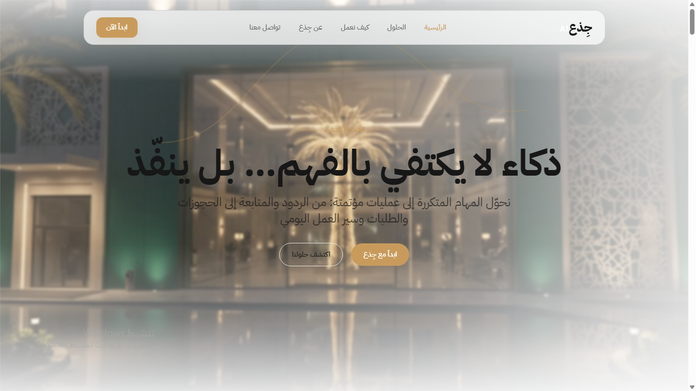

# جذع AI | WUSOOL AI — الموقع الرسمي

<p align="center">
  
</p>

<p align="center">
  <strong>AI Automation for Hospitality & Tourism</strong>
</p>

React + TypeScript + Vite + Tailwind CSS + Framer Motion. لا يوجد Next.js.

## التشغيل محليًا

يحتاج هذا المشروع اتصالاً بالإنترنت لتحميل الحزم أول مرة فقط:

```bash
npm install
cp .env.example .env.local   # ثم عبّئ رقم واتساب ورابط استقبال النماذج
npm run dev
